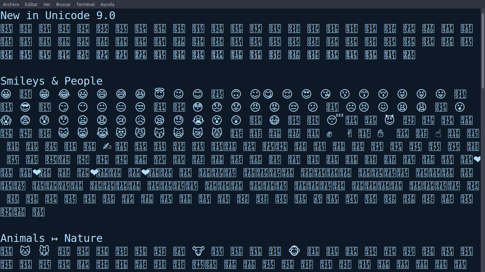
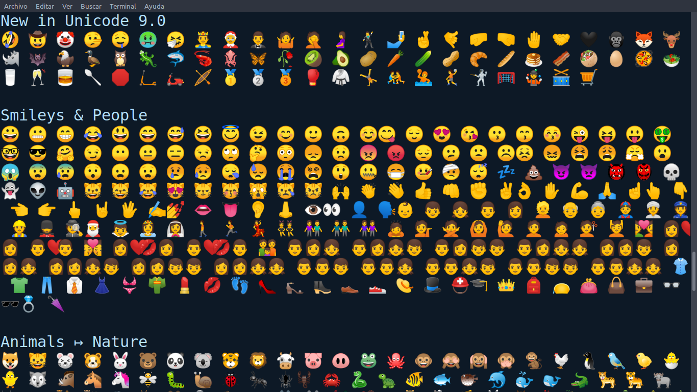

# Emojix
[](https://github.com/edicsonabel/emojix/releases/latest)
[](https://github.com/edicsonabel/emojix/issues)
[](https://github.com/edicsonabel/emojix/network/members)
[](https://github.com/edicsonabel/emojix/stargazers)
[](LICENSE)

<a href="https://github.com/edicsonabel/notes">
  
</a>

😱 This script allows to install the emojis of `fonts-noto-color-emoji` in our 🐃GNU/Linux🐧 and the necessary configuration to visualize👁 them in terminal as well as in the browser💻 and if you are here, it is because you love❤️ to use the emojis 😍 in a crazy way as we do 😬.

## Getting Started 🚀 
To perform the installation we must meet the following requirements.
- GNU/Linux system (of course)
- Superuser permissions `sudo`💪.

We can make the installation in a normal way or with option to update the font of `NotoColorEmoji.ttf` that is in the official google repository using the option `-u` or `--update`.

### Installation
```sh
sh -c "$(wget -O- https://raw.githubusercontent.com/edicsonabel/emojix/master/install.sh 2>/dev/null)"
```
### Installation with update
```sh
wget https://raw.githubusercontent.com/edicsonabel/emojix/master/install.sh -O /tmp/emojix 2>/dev/null;chmod +x /tmp/emojix;sh /tmp/emojix -u
```
After you have completed the installation, you must close the programs such as terminal, browser, editor, etc. and open them again to view the emojis.

### Show example in terminal
You can use the display example in the terminal by opening a new one and entering the following code.
```sh
echo "$(printf "$(wget -O- https://raw.githubusercontent.com/edicsonabel/emojix/master/example.txt 2>/dev/null)")"
```
<a href="assets/example.png">
  
</a>

## Failures ❌
#### Emojis are not displayed in my terminal
- Perhaps you have not closed the terminal after installation and opened a new terminal to load the settings.
- You should also update the font cache with the command `fc-cache -f -v`.

#### Emojis are not displayed in my browser
- Your browser may have a default font for `sans-serif` in preferences, so you should go to `preferences` in browser and change the default font from `sans-serif` to` Noto Color Emoji`.

## Examples 😱
### Terminal without Emojix
<a href="assets/terminal-without-emojix.png">
  
</a>

### Terminal with Emojix
<a href="assets/terminal-with-emojix.png">
  
</a>

### Browser without Emojix
<a href="assets/browser-without-emojix.png">
  
</a>

### Browser with Emojix
<a href="assets/browser-with-emojix.png">
  
</a>
